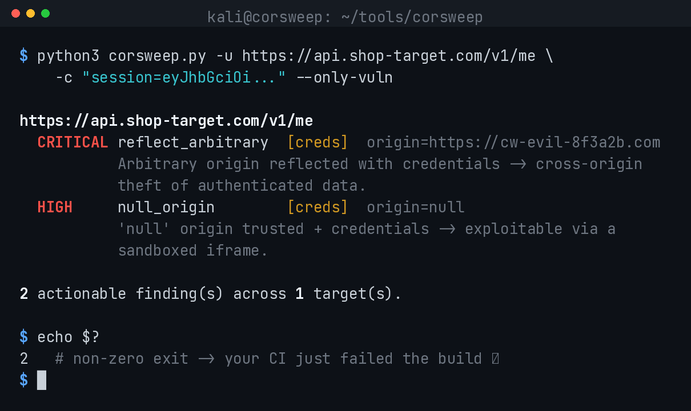
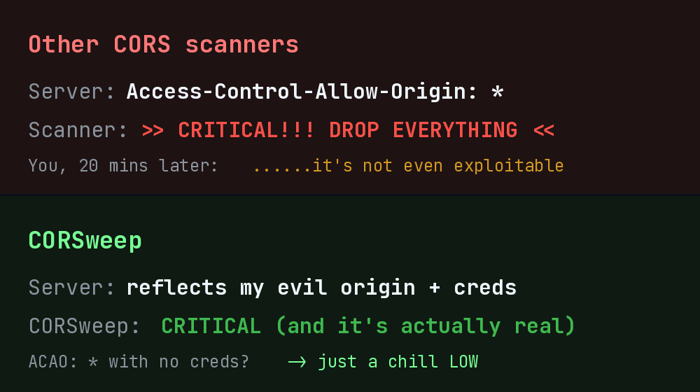

<h1 align="center">CORSweep 🧹</h1>

<p align="center">
  <b>A CORS misconfig scanner that doesn't cry wolf.</b><br>
  <i>Halal money earn bro — one Access-Control-Allow-Origin at a time.</i>
</p>

<p align="center">
  
  
  
  
  
</p>

<p align="center">
  
</p>

---

## Why another CORS tool? 🤨

Real talk — I got tired of scanners flagging `Access-Control-Allow-Origin: *`
like it's the end of the world and then me wasting 20 minutes proving it's not
exploitable. So I built one that only shouts when it's actually worth shouting.

<p align="center">
  
</p>

> **The one rule that kills false positives:** a reflection only counts when
> `Access-Control-Allow-Origin` **exactly equals** the Origin we sent. Server
> locks it to a fixed value? We stay quiet. `*` with no creds? That's a LOW,
> not a heart attack.

---

## What it catches

| Test | The flaw | Payload |
|------|----------|---------|
| `reflect_arbitrary` | Reflects literally any origin | `https://cw-evil-...com` |
| `null_origin` | Trusts `null` (sandboxed iframe trick) | `null` |
| `http_downgrade` | HTTPS site trusting `http://` | `http://target` |
| `prefix_bypass` | `startsWith` / lazy regex | `https://target.evil.com` |
| `suffix_bypass` | `endsWith` / unanchored regex | `https://eviltarget.com` |
| `unescaped_dot` | Someone forgot to escape the `.` | `https://targetxcom` |
| `special_char` | Backtick / underscore parser tricks | `https://target%60.evil.com` |
| `subdomain_trust` | Trusts any subdomain | `https://cw-sub.target` |

Severity is scored on whether `Access-Control-Allow-Credentials: true` is
actually there — so a **CRITICAL** genuinely means "someone can read your
logged-in user's data from evil.com." Not vibes. Real impact.

---

## Get it running (30 seconds)

```bash
git clone https://github.com/suhelkathi/corsweep
cd corsweep
pip install -r requirements.txt
```

## Use it

```bash
# quick single shot
python3 corsweep.py -u https://api.target.com/user/profile

# authenticated scan — THIS is where the CRITICALs live 🔥
python3 corsweep.py -u https://api.target.com/me -c "session=abcd1234"

# whole list, hide the noise, save JSON for your report
python3 corsweep.py -l hosts.txt --only-vuln --json out.json

# pipe it through Burp like a civilised person
python3 corsweep.py -u https://target -k --proxy http://127.0.0.1:8080
```

<!-- meme idea: "this is fine" dog in burning room, caption: "me watching the
     scanner return 0 findings on a target I KNOW is broken" -- add it here -->

---

## Confirm it by hand (always confirm, kids)

```bash
curl -s -I https://api.target.com/me \
  -H "Origin: https://cw-evil-8f3a2b.com" \
  -H "Cookie: session=..." | grep -i access-control
```

Evil origin echoed back + `Access-Control-Allow-Credentials: true`? Ship the
finding. 📸

---

## Roadmap

- [x] CORS scanner that doesn't lie to you
- [ ] Host header injection module (same accuracy energy)
- [ ] OAuth `redirect_uri` checker
- [ ] Maybe a cross-site WebSocket hijacking module if you all star this enough 👀

---

## ⚠️ Don't be dumb

Only run this on stuff you're **allowed** to test. A signed scope or a bug
bounty program. That's it. Getting a CORS finding is cool. A legal notice is not.

---

<p align="center">
  Built by <a href="https://github.com/suhelkathi">@suhelkathi</a> ·
  if this saved you time, smash that ⭐ — it's free and it feeds my ego
</p>
